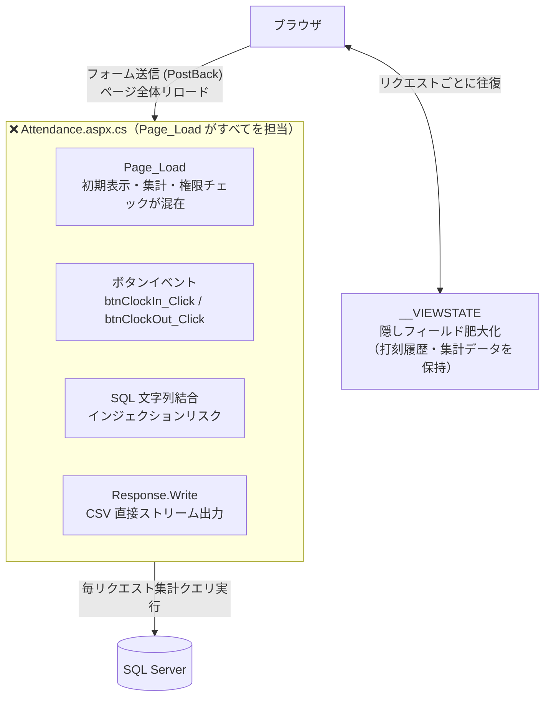
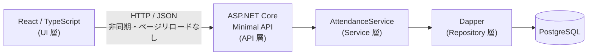
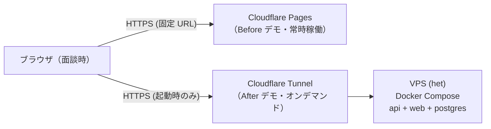

# アーキテクチャ概要

## Before: WebForms 密結合

---

## After: レイヤー分離

---

## コンポーネント責務

| コンポーネント | 責務 |
|---|---|
| React (src/Web) | 状態管理・表示のみ。PostBack・ViewState を持たない |
| Minimal API (Program.cs) | ルーティング・リクエスト受付 |
| AttendanceService | 月次集計・打刻バリデーション・トランザクション管理 |
| Dapper | パラメータ化クエリによる安全な DB アクセス |
| Docker Compose | 環境依存の排除。ローカル〜本番同一構成 |

---

## Before / After の構造対比

| WebForms の問題 | 対応する After の設計 |
|---|---|
| AutoPostBack → 部署選択のたびに全画面リロード | React の state 更新 → リロードなし |
| ViewState → リクエストに巨大な隠しフィールドが混入 | サーバー側状態管理を廃止。必要時のみ API フェッチ |
| Page_Load 集中 → 初期表示・集計・権限チェックが混在 | AttendanceService へ責務分離。xUnit でテスト可能 |
| Response.Write → 文字化け・エラー制御不能 | `Content-Disposition` エンドポイント。UTF-8 保証 |

---

## インフラ構成

### デモ運用

| | Before | After |
|---|---|---|
| ホスティング | Cloudflare Pages | VPS + Cloudflare Tunnel |
| 起動 | 常時稼働 | 面談前に `systemctl start` |
| URL | 固定（`*.pages.dev`） | 起動のたびに `journalctl` で確認 |
